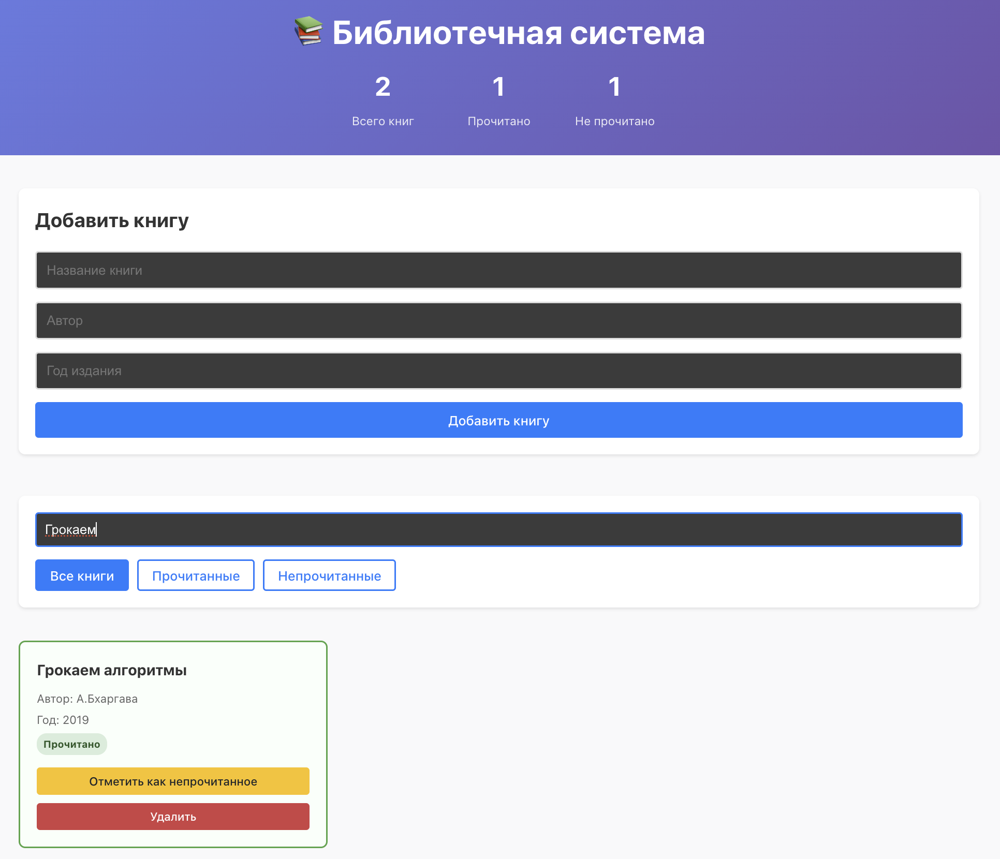

# Библиотечная система

## Описание
Мое первое React приложение для управления личной библиотекой.

## Функционал
- ✅ Добавление книг
- ✅ Удаление книг  
- ✅ Изменение статуса прочитано/не прочитано
- ✅ Фильтрация по статусу

## Технологии
- React 19.1.0
- Vite
- CSS Modules
- https://33d6d7af49dbe331.mokky.dev/books

## Установка и запуск
\`\`\`bash
npm install
npm run dev
\`\`\`

## Скриншоты

